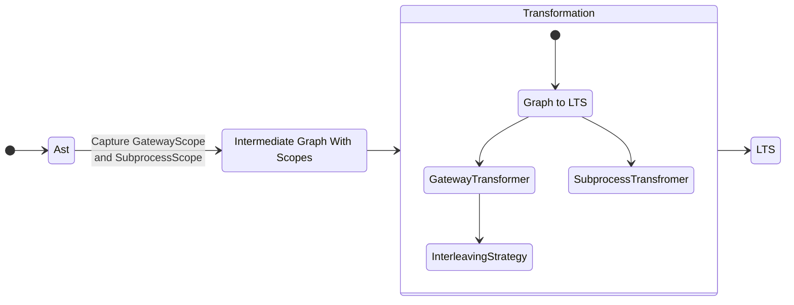
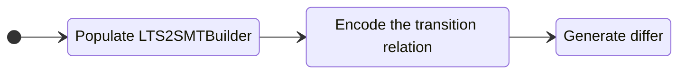

# Transform a BPMN given as workflow ast to a LTS with conditions

## Diffing workflow diagrams using LTS and SMT

### From Ast to LTS

The transformation is designed with extensibility and changeability in mind.
Therefore, the flow-graph is modularized and transformed in multiple steps.
We define gateway scopes and subprocesses as meta elements which are transformed individually.
After transforming the AST to an `IntermediateGraphWithScopes` this graph is transformed hierarchically.
Most transformation steps are separately implemented making extensive use of the _strategy_ pattern.
Every `ASTFlowNode` is transformed to a `String` using a `NamingStrategy`.

### From Diagram to SMT Diff

## Overview

- `wf2lts` contains the logic of converting wf diagrams to an lts
    - `datastructure` contains necessary auxiliaries as intermediate steps.
    - `scopes` contains meta elements for the `IntermediateGraphWithScopes`
    - `transformer` are strategy-interfaces and their implementations for transforming the individual components of a
      bpmn
      to lts
    - `collector` are visitors to collect start events or end events of a list of `FlowNodes`
- `wf2smt` contains the logic of diffing two wf-diagrams using smt
    - This package uses `wf2lts` to convert diagrams to lts first

## Assumptions

#### Assumptions about the input BPMN

- Every flow starts with a _start_ event
- There is only one _start_ event for the root process
- Every flow ends in an _end_ event
- No _end_ event has outgoing flows
- See section `GatewayScope`

#### `GatewayScope`

- Every `split` gateway is only closed by `merge` gateway of the same type
    - Every path starting from a `split` gateway of type $T$ does not reach a `merge` gateway of another type ($T'$)
      without a `split` gateway before of type $T'$
- `split` gateways have at most one corresponding `merge` gateway
    - Every path starting from a `split` gateway ends in an end-event or one unique `merge` gateway

#### `InterleavingStrategy`

- The `LTSWithFinalStates` given to a `InterleavingStrategy` has $n$ outgoing transitions $t_i$
    - No state reachable from one of the transitions $t_i$ can be reached from any of the other transitions
    - Meaning they are fully disconnected
    - Every $t_i$ should is considered equally and will be interleaved according to the strategy
    - The final states of the lts can be arbitrarily changed in the returned interleaved `LTS`
        - There is no guarantee for the relation of given final states to returned final states
- An interleaving strategy does not introduce new label to a lts
- There is no transition that has the start state as target state

#### `GatewayTransformer`

- The `GatewayScope` has an `ASTGateway` as start node of its internal graph
- The provided `externalGraph` can be changed inside `transform`
- The returned `LTS` can be the modified `externalGraph` but doesn't have to be
- The name of the split `ASTGateway` of the provided `GatewayScope` exists as transition-label in the external graph
    - `externalLTS.allUsedLabels().contains(namingStrategy.apply(gatewayScope.getGraph.getStart()))`
    - The same holds for the *merge* gateway, if the `gatewayScope.getClosingGateway().isPresent()`
- The transformed internal graph has the name of the split gateway as only transition from the start state
    - The target of this transition has only this one incoming transition
- Each source state of a merge transition in the transformed graph of the GatewayScope is marked as final state in
  the `LTSWithFinalState`
- The returned `LTS` neither contains the name of the split gateway nor of the merge gateway (if it was present)

#### `SubprocessTransformer`

- The `externalLTS` will be modified instead of returning the transformed `LTS`
    - TODO make the interface symmetric to `GatewayTransformer`
- The external LTS contains the subprocess name as transition
    - `externalLTS.allUsedLabels().contains(namingStrategy.apply(subProcessScope.getSubProcess())`
- The `SubprocessTransformer` can replace this transition with
    - Splitting it into a start and end transition
    - only its inner LTS (and remove the subprocess from the TLS)

#### Interpretation of the semantics of bpmn

- Events are triggered implicitly
    - A catch event is activated without the need of a previous throw event
- Every start event of a subprocess is triggered when the subprocess is reached
- If a split gateway has no incoming flows it is unreachable and never activated

## Not implemented

- Boundary events of subprocesses
- Loop-characteristics for tasks (`MILoop`, `StandardLoop`)
- Event-based gateways
- Complex gateways
- Lanes and pools
- Data objects and IOSpecifications
- Branching flows (`Split -> {A,B}`)
- Looping-Gateways that are not *exclusive*
    - If the `split` gateway can be reached from its `merge` gateway and the type of the gateway is not `xor`
- `ASTExpressions` are not evaluated in the smt-diff
- `InclusiveGatewayStrategy` that conform to the spec

### Don't be confused

- Even tho it is called `lts` and `LTSBuilder` it does not necessarily resemble a formal LTS
- The used "`LTS`" is more like really just a directed labelled graph
    - There is no label for states but one label for each transition
    - There is one unique start state
    - Transitions have conditions
    - Transitions dont have actions
    - We call a list of transitions (source, label, conditions, target) a _path_
