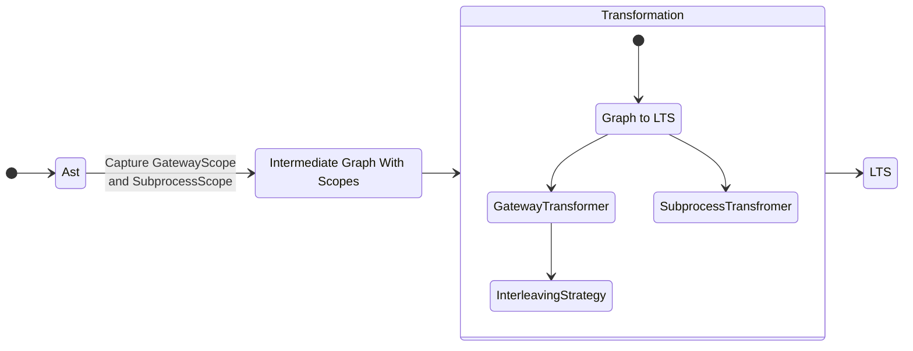

# Transform a BPMN given as workflow ast to a LTS with conditions

## From Ast to LTS

## Overview

- `datastructure` contains necessary auxiliaries as intermediate steps.
- `scopes` contains meta elements for the `IntermediateGraphWithScopes`
- `transformer` are strategy-interfaces and their implementations for transforming the individual components of a bpmn
  to lts
- `collector` are visitors to collect start events or end events of a list of `FlowNodes`

## Current state

| Component                    | Implemented | Tested |
|------------------------------|-------------|--------|
| GraphBuildingTransformer     | x           |        |
| IntermediateGraph            | x           | -      |
| IntermediateGraphWithScopes  | x           |        |
| LTS                          | x           |        |
| GatewayScope                 | x           |        |
| SubprocessScope              | x           |        |
| NamingStrategy               | x           | -      |
| GatewayTransformer           | x           | -      |
| SubprocessTransformer        | x           | -      |
| GatewayInterleavingStrategy  | x           | -      |
| Graph2LTSTransformer         | x           | -      |
| DefaultGatewayTransformer    | x           | x      |
| DefaultSubprocessTransformer | x           | WIP    |
| DefaultGraph2LTSTransformer  | x           | x      |
| DefaultGatewayInterleaving   | x           | WIP    |
| DefaultParallelInterleaving  | WIP         |        |