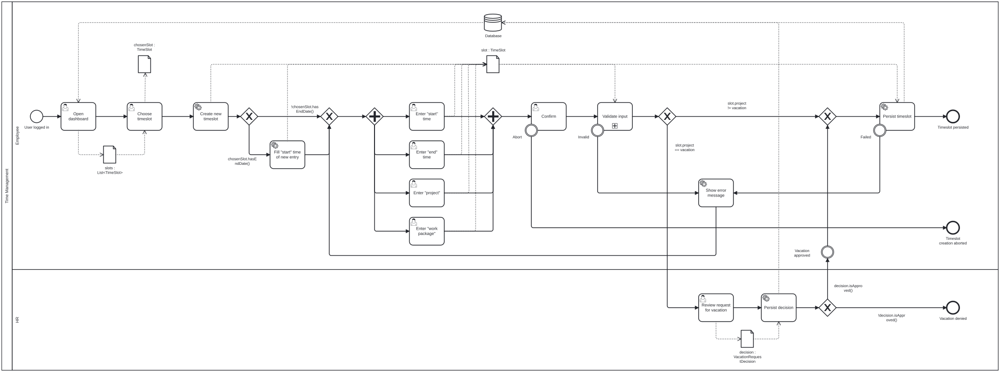
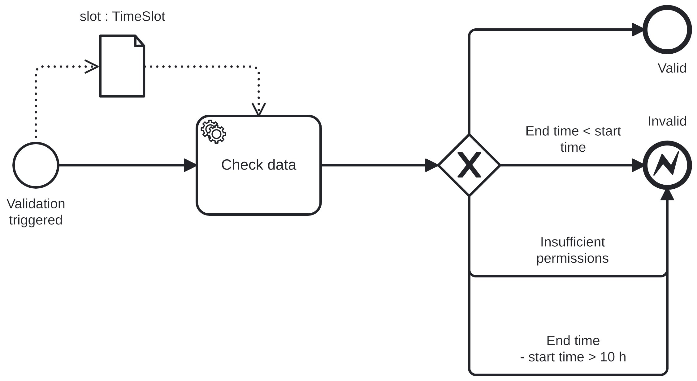
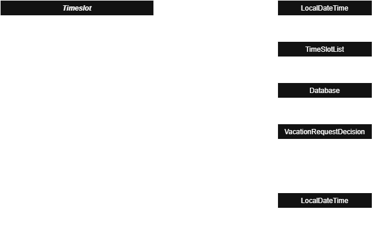

# Project Overview

## Goal

The goal of this project was to evaluate whether and to which extent the already
existing BPMN implementation is able to handle the communication between the
CD and the BPMN DSLs.
The project is motivated by the fact that both DSLs were largely developed independently
even though combining both is useful for real-world business cases.
For this, we agreed on first defining an extensive business case, and then create
the following artifacts:
1. A class diagram representing data required for the process
2. A [BPMN](https://bpmn.io/) process that handles the flow of our business case
3. Translations of both to the corresponding DSLs

# TimeManagement Process


*Process 1: Main process to handle the business case*

*Process 2: Sub-process to validate the user input*

## Business Case

In our main process given above, an `Employee` wants to log working hours or apply
for approval of an upcoming vacation.
For this, we have two stakeholders, being the `Employee` and the `HR` representative.
In the beginning the `Employee` opens the dashboard, which shows their (we use
gender-neutral language here) already logged timeslots. These timeslots are
persisted on a database and locally represented as a list of `TimeSlot` objects.
Upon choosing an empty timeslot with the intention to mark it as vacation, the
system creates a new `TimeSlot` object.
**TODO**: Explain `chosenSlot.hasEndTime()` branching.
Next, the `Employee` manually inserts the information of the new `TimeSlot`, and
confirms the input or aborts the creation.
As the order of the input does not really matter, for this step the process relies
on parallel user tasks.
Afterward, the given user input gets validated in the sub-process illustrated above.
Here, the input data gets both checked for consistency, e.g., that the times
represent a valid `TimeSlot` and additional business requirements.
In case of valid inputs, the process continues depending on whether the chosen
`project` equals to `vacation` or not.
In the former, the process redirects the vacation request to `HR`, and in the latter
it directly persists the created `TimeSlot` to the database.
Otherwise, i.e., in the case of invalid input, the process shows an `ErrorMessage`
and redirects the `Employee` back to correct the corresponding information.
If there occurs an error while persisting the data, an `ErrorMessage` is returned
to the user and the process leads back to the user input stage.
In case of a vacation request, `HR` needs to manually verify the request and
create a `VacationRequestDecision`.
For traceability, this decision also gets persisted on the database.
Depending on whether the request got approved or not, the `TimeSlot` gets either
persisted or the process ends.

## Design Decisions

- The workflow of the process is inspired by the internal worklog tool of the i3 chair.
  **TODO Christoph: Please mention the tool name here.**
- During the creation of the process we tried to incorporate as many different
  concepts of the BPMN standard as possible.
- For better readability of the process, we decided to place the validation of
  the input into a sub-process, as depicted in the graphics above.
- To integrate a second actor into the process, we require a timeslot linked
  to the 'vacation' project to be approved by `HR` before.
- For faults caused by either user input, e.g., aborting a task, or technical causes
  we relied on intermediate throw events to avoid using too many gateways which
  do not really contribute or further clarify the business case.

## Class Diagram



*Class Diagram 1: Data model of the process*

When modeling the class diagram we focused on staying close to the vocabulary of
the process to make it easier to understand the data flow.
In the CD, `TimeSlot` represents a certain time slot that can be booked to some
project or vacation, which we modeled as a dedicated vacation project.
As a `TimeSlot` is not required to have an `endTime`, we connected them by a `[0..1]`
association.
The Boolean operations `hasEndTime()`, `isVacation()`, `endTimeBeforeStartTime()`,
`insufficientPermissions()` and `durationGreaterThanTenHours()` each correspond
to gateway conditions in the process.
For the `TimeSlotList` we added an association.
The additional classes `VacationRequestDecision` and `ErrorMessage` are kept as
small as possible as they only model side effects that are not central to the
business case.
The `Database` class is only included to enable the process model to resolve the
symbol `store database:Database`.

# Technical Details

## Project Structure

As we forked the existing BPMN repository of MontiCore, our project-specific
results are added to the predefined project structure.
However, for completeness, we give a short overview of the complete repository,
which is made up of three modules:
- `WorkflowDSL` contains the MontiCore grammar in form of [`Workflow.mc4`](/WorkflowDSL/src/main/grammars/de/monticore/bpmn/Workflow.mc4),
  which defines a process language that mimics the BPMN standard.
- `WorkflowConformance` contains implementation that allows to check whether
  a process model conforms to some reference model.
- `WorkflowCLI` contains the `WorkflowTool.java`, which implements the
  command-line entry point for parsing, pretty-printing and conformance-checking
  models. Here, we indirectly utilize the `BPMNConformanceUtils` to load models.

Our contributions can be found at the following places in the `WorkflowConformance` module:
- `TimeManagement.cd`: ` src/test/cd2pojo/de.monticore.bpmn.conformance.sleProject/`
- `TimeManagementIncomplete.cd`: ` src/test/cd2pojo/de.monticore.bpmn.conformance.sleProject/`
- `TimeManagement.wfm`: `src/test/resources/de/monticore/bpmn/conformance/sleProject/`
- `TimeManagementIncomplete.wfm`: `src/test/resources/de/monticore/bpmn/conformance/sleProject/`
- `SleProjectTest.java`: `src/test/java/de/monticore/bpmn/conformance/`

## Gradle Setup

To avoid replicating the Gradle infrastructure of the already existing project
and to simplify the migration into the existing MontiCore codebase later, we
decided to create a fork of the [existing BPMN repository](https://github.com/MontiCore/bpmn)
instead of working in the created [GitLab repository](https://git.rwth-aachen.de/se-student/ss26/lectures/sle/projects/bpmn4cd).
In addition to the already existing Gradle setup and dependencies, we added
the `cd2pojo` dependency to be able to process CDs directly.
When triggering the test build, `cd2pojo` parses the CD models in `WorkflowConformance/src/test/cd2pojo/...`
and generates the corresponding symbol tables (`*.cd`) under `target/cd2pojo/test/symbols/...`.
These symbol table files are then added to the global symbol path `WorkflowMill`.

As usual, the project can be built by executing:
```
gradle build
```

To execute only the tests created for our proof-of-concept, we created a Gradle
task that can be executed by:
```
gradle testSleProject
```

## Test Cases

### Happy Case: loadsSymbolsFromCD

This test case loads the business process `TimeManagement` via the
`BPMNConformanceUtils`, and ensures that no errors occur during the processing.

### Bad Case: failsForIncompleteSymbolsFromCD


# Project Evaluation

In the following, we discuss the limitations of the results produced throughout
our project and the whole BPMN project itself with respect to the goals initially
agreed on.
We hope this will be useful for follow-up projects.

## Goal Achievement and Limitations

We successfully defined a business case, created the corresponding class diagrams,
an extensive BPMN process and translated them to the existing DSLs.
Therefore, goals 1-3, as defined on the [kick-off slides](/doc/sleProject/Kickoff.SLE26.bpmn4cd.pdf),
were fully achieved.
Goal 4, i.e., the access to the data given by class diagrams through the process,
was achieved partially; in more detail:

- It is possible to realize static, symbol-table-level access to `data` items in
  the corresponding WFM-file. These items and their operations defined in the
  class diagram may be referenced in, for example, gateway conditions and are
  correctly resolved and type-checked against the generated symbol table.
  We illustrate this by our two test cases detailed below.
- However, as there is no executable process engine, we were not able to clarify
  whether it is possible to access the data during runtime. Creating such an
  executable process engine is clearly out of scope for this project. Thus, this
  might present an opportunity for future work.
- In addition, we investigated whether it is possible to write from the process
  to the class diagrams to manipulate the definition thereof in case there are
  `data` items referenced in the process that were not defined in the corresponding
  class diagrams. However, **TODO Johannes: extend on this part**

**TODO: Johannes:** Please explain what you tried regarding inserting elements
into the class diagram which are required by the process but are not yet part
of the CD.

# Organizational Details

## Team (alphabetically)

- Johannes Kurth
- Peter Lindner
- Christoph Lütticke
- Abdullah Rehman

**Supervisor**: Sedat Cakici

## General Workflow

Most of our work is a result of meeting on Discord and working on the problems at the
same time through pair programming. This allowed us to both keep all members up-to-date
and also ensure that the time committed per person is spread evenly among the team members.
During the meetings we took notes to guarantee that we meet all expectations of our
supervisor.

## Usage of AI Tools

We used Codex for the first translation of our process from the BPMN format to 
the WFM encoding. However, we were required to manually adjust the WFM-file as
we were not completely satisfied with the result.
All other kinds of implementation and writing was done by ourselves without the
assistance of any AI tooling.
