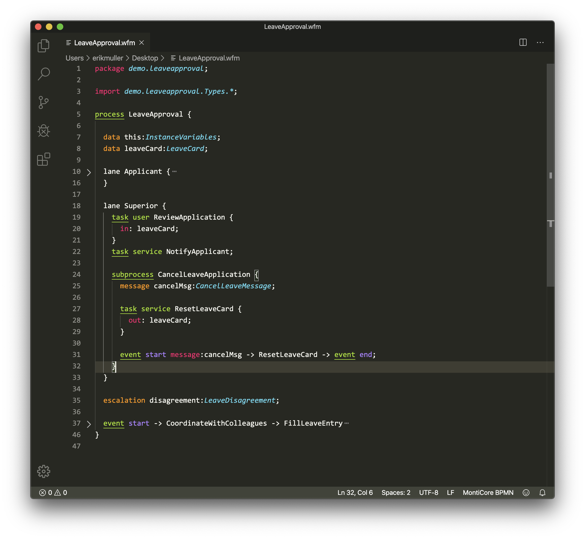

# BPMN-DSL Syntax Highlighting

## About the Project

This extension provides syntax highlighting for [Visual Studio Code]([vscode-website).



### Built With

- [IRO](iro-website]) - a development tool designed to simplify the creation of syntax highlighters across many platforms

## Getting Started

### Installation

1. Copy the parent folder `monticore-bpmn/` to your VS Code extensions folder, e.g., `~/.vscode/extensions/`
2. Restart VS Code

## Develop

To adjust the syntax highlighting

- Import the file [`syntaxes/bpmn.iro`](syntaxes/bpmn.iro) from this repository in the [IRO web editor](iro-editor)
- Apply your changes
- Copy the Textmate output to the file [`syntaxes/bpmn.tmLanguage.plist`](syntaxes/bpmn.tmLanguage.plist)
- Run
  ```bash
  plutil -convert json bpmn.tmLanguage.plist -o bpmn.tmLanguage.json
  ```
- Restart VS Code

## Useful Links

- [Visual Studio Code — Syntax Highlight Guide](vscode-syntax-hightlight-guide)
- [Visual Studio Code — Programmatic Language Features](vscode-syntax-hightlight-guide)
- [Introducing Iro — An Easier Way To Create Syntax Highlighters](iro-blog-article)

[vscode-website]: https://code.visualstudio.com
[iro-website]: https://eeyo.io/iro/documentation/
[iro-editor]: https://eeyo.io/iro/
[vscode-syntax-hightlight-guide]: https://code.visualstudio.com/api/language-extensions/syntax-highlight-guide
[programmatic-language-features]: https://code.visualstudio.com/api/language-extensions/programmatic-language-features
[vscode-change-language-mode]: https://code.visualstudio.com/docs/languages/overview#_changing-the-language-for-the-selected-file
[iro-blog-article]: https://medium.com/@model_train/creating-universal-syntax-highlighters-with-iro-549501698fd2
